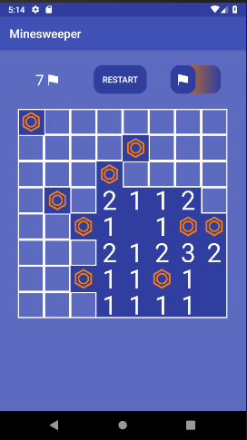
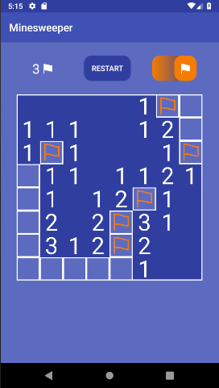

# Minesweeper
This Minesweeper Android application is a class project from Mobile Software Development (taught by Péter Ekler at AIT Budapest). It is an implementation of the classic game optimized for mobile phones.

## Features
This application implements the basic features of Minesweeper. The game board is a custom View that responds to touch events from the user and communicates with the underlying model class to keep track of the current game state. It allows the user to uncover squares, displaying the number of mines surrounding that square. When a user clicks on a square that has no surrounding mines, all squares around it are automatically opened up. If a square is a mine, it uncovers all mines on the board and shows the user a Snackbar indicating that the game is over.



When the user identifies a mine, they may choose to flag the square by toggling on the flag switch and clicking on the square where the mine is located. There are exactly the same number of flags as mines, so the user cannot place more flags if they run out. The user is not required to place flags on all the mines (they can still win the game as long as all non-mine squares are uncovered and all mine squares are still covered).



The application's simple user interface makes it easy for the user to analyze the current game state, flag mines, and restart the game if they have lost. Additionally, in the underlying model class, the dimensions of the board and number of mines can be easily adjusted without affecting the overall functioning of the application (but this is not currently possible to alter from the UI).

## Repo structure
For simplicity, only relevant files and directories (i.e. files created or modified by me, not auto-generated by Android Studio) are included in this diagram.

```
├── README.md                       : Description of this repository
│
└── Minesweeper/app                 : Project files
    ├── src/main                    
    │   ├── java/.../minesweeper    : Primary Kotlin classes for the project
    │   │   ├── model               : MinesweeperModel.kt
    │   │   ├── ui                  : MinesweeperView.kt
    │   │   └── MainActivity.kt     : Kotlin class for the main Activity
    │   │
    │   ├── res                     : companion resource files for the project
    │   │   ├── drawable            : xml files for custom track and thumb for the flagging toggle, custom Restart button
    │   │   ├── layout              : xml file for the MainActivity layout
    │   │   └── values              : xml files for extracted strings and customized styles
    │   │
    │   └── AndroidManifest.xml     : manifest file for the application
    │
    └── build.gradle                : gradle file for the app module
```

## Future improvements
Since the code can be easily modified to change the size of the board and number of mines, this application could be changed in the future to include multiple levels or different difficulties with boards of different sizes.

I would like to slightly modify the way the mines are randomly generated, so that they are placed after the user's first click. This would prevent the user from every clicking on a mine on their first move, when they don't yet have any clues as to where mines might be hidden.

I would also like to make this application adaptable to different screen sizes. In particular, the screen layout has not been optimized for tablets or landscape orientation.

### Contributors
Jessie Baskauf
